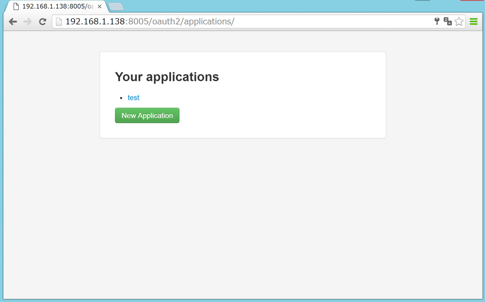
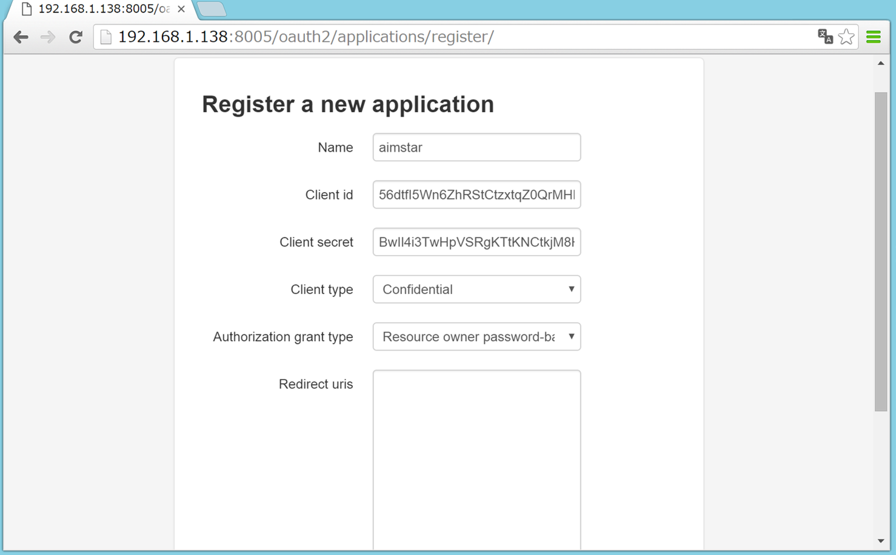
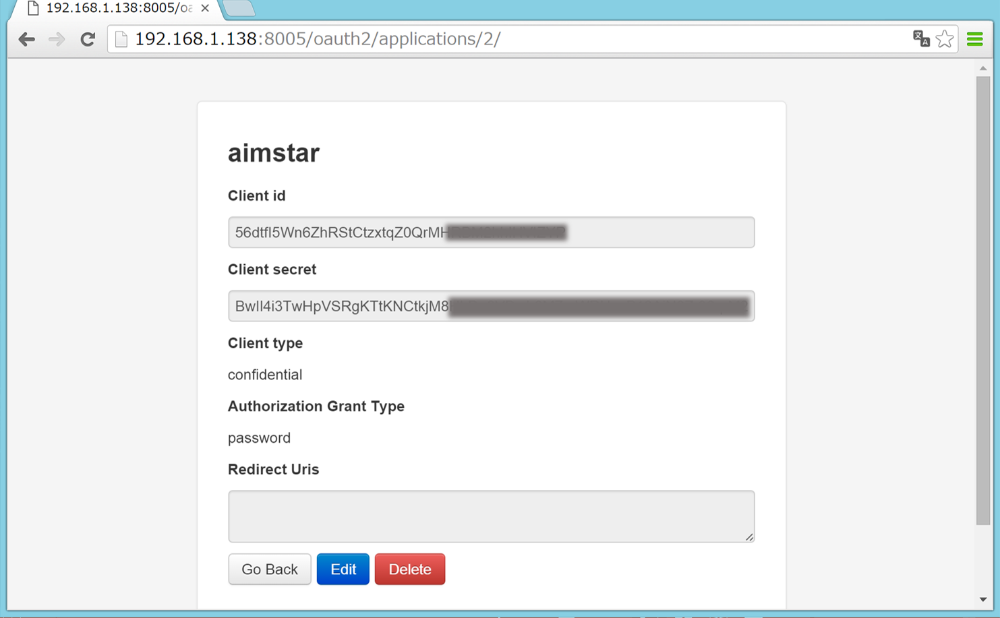

***************
Getting Started
***************

Authorization
=============
| Barn-owl-api uses OAuth 2.0 for user authorization and API authentication.
| If you don't have barn-owl-api access username/password, please contact to :doc:`Support <index>` .
|

Register your client application on database
--------------------------------------------

For the first time,You have to push 'New Application' button and register your client application on database.

In registration page, please set as follows:
   Name :
      Input any client name
   Client type :
      Choose 'Confidential'
   Authorization grant type :
      | If you access only from aimstar, choose 'Resource owner password-based'.
      | If you access via other client applications, choose 'Implicit'.
      

Request an access token
-----------------------
In order to obtain an access token, use client_id and client_secret with "password" grant type.

An example with HTTPie, which is a command line HTTP client, is as follows,

.. code-block:: shell

   http --verify no -f POST https://192.168.1.138:8005/oauth2/token/ grant_type=password username=**** password=**** client_id=**** client_secret=****

The response:

.. code-block:: python

   HTTP/1.0 200 OK
   Cache-Control: no-store
   Content-Type: application/json
   Date: Thu, 25 Feb 2016 03:18:44 GMT
   Pragma: no-cache
   Server: WSGIServer/0.2 CPython/3.4.3
   X-Frame-Options: SAMEORIGIN

   {
    "access_token": "H1LYGR**************", 
    "expires_in": 36000,
    "refresh_token": "JktmfA****************",
    "scope": "write read groups",
    "token_type": "Bearer"
   }
    
Request ana access token with refresh token
-------------------------------------------

Once the token expires, get a new one with refresh token.

.. code-block:: shell

   http --verify no -f POST https://192.168.1.138:8005/oauth2/token/ grant_type=refresh_token client_id=**** client_secret=**** refresh_token=JktmfA****

Access to API using HTTP Method
-------------------------------

For instance, you can make a linear regression model as follows,

.. code-block:: shell

   http --verify no -f POST https://192.168.1.138:8005/v1/regression/linear/  Authorization:"Bearer <access_token>" 

.. code-block:: python

   HTTP/1.0 201 CREATED
   Allow: GET, POST, HEAD, OPTIONS
   Content-Type: application/json
   Date: Thu, 25 Feb 2016 07:34:41 GMT
   Server: WSGIServer/0.2 CPython/3.4.3
   Vary: Accept
   X-Frame-Options: SAMEORIGIN

   {
    "code": "",
    "created": "2016-02-25T07:34:41.381840Z",
    "decomp_algorithm": "PCA",
    "decomp_components": 2,
    "decomp_flg": false,
    "features": "",
    "id": 1,
    "owner": "user1",
    "status": "Created",
    "target": "",
    "title": "",
    "train_data": null,
    "trained_data": [],
    "updated": "2016-02-25T07:34:41.381994Z"
   }
   
More information about model parameters, check :ref:`regression refference <regression-model>`.

After finishing learning process, you can get predicted values from the trained model and model's information with a query paramter "mode".

.. code-block:: shell

   http --verify no -f GET https://192.168.1.138:8005/v1/regression/linear/1/  Authorization:"Bearer <access_token>" mode==evaluate range==3

The response:

.. code-block:: python

    HTTP/1.0 200 OK
   Allow: GET, PUT, DELETE, HEAD, OPTIONS
   Content-Type: application/json
   Date: Thu, 25 Feb 2016 08:06:36 GMT
   Server: WSGIServer/0.2 CPython/3.4.3
   Vary: Accept
   X-Frame-Options: SAMEORIGIN

   {
    "coefficient": [
        7.9239020347595215,
        -0.008510926738381386,
        0.4589046835899353
    ],
    "data": [
        {
            "id": "20",
            "prediction": "3.17",
            "target": "4.00"
        },
        {
            "id": "30",
            "prediction": "3.17",
            "target": "7.00"
        },
        {
            "id": "45",
            "prediction": "3.17",
            "target": "5.00"
        },
        {
            "id": "78",
            "prediction": "19.02",
            "target": "13.00"
        },
        {
            "id": "93",
            "prediction": "11.09",
            "target": "10.00"
        }
    ],
    "features": [
        "RFA_2A",
        "RFA_3A",
        "RFA_4A"
    ],
    "intercept": 3.169978141784668,
    "score": 0.33944664118741463,
    "target": "TARGET"
   }

More about detail, check :ref:`API Reference <api-reference>`.    